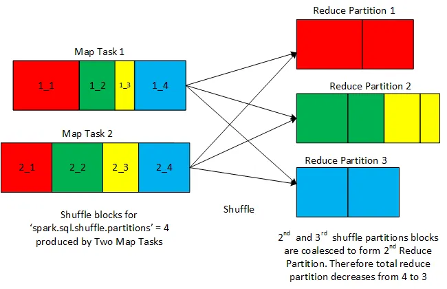

# Coalescing post-shuffle partitions 

A shuffle is made up of two consecutive stages. The first one is a map stage that writes the shuffle blocks (corresponding to configured shuffle partitions number).  
The Map stage is followed by a reduce stage that reads relevant shuffle blocks , combines them with respect to their shuffle partitions number, and then subsequently  
runs the reducer logic on each of the combined data block.  

It is between map and reduce stages of a shuffle where ‘Dynamic Coalescing’ operates. Actually, what happens is that after the map stage before a shuffle gets completed  
(after writing all the shuffle data blocks), it reports lots of stats, such as number of records and size of each of the shuffle partition, about the resulting shuffle  
partitions (as dictated by the config “spark.sql.shuffle.partitions”) to the Spark execution engine.

These reported stats prompts the execution engine to consult ‘Dynamic Coalescing’ module to inspect for a potential optimization  when the shuffle partitions are coalesced to a  lower number.  
‘Dynamic Coalescing’ consults the stats produced by the map side of a shuffle and some other configurable parameters (to provide flexibility in behavior) in order to compute a  
optimum target size for a coalesced partition. Based on the computed target size, estimation is done for the number of coalesced shuffle partitions. In case if the estimated number  
comes below the number dictated by “spark.sql.shuffle.partitions”, ‘Dynamic Coalescing’ module inserts dynamically,  
at runtime, a subsequent coalesce transformation having input parameter as the estimated number of coalesced shuffle partitions.

## Parameters
### spark.sql.adaptive.advisoryPartitionSizeInBytes:
Default Value : 64 MB  
The advisory size in bytes of the shuffle partition during adaptive optimization (when spark.sql.adaptive.enabled is true).  
It takes effect when Spark coalesces small shuffle partitions or splits skewed shuffle partition.

### spark.sql.adaptive.coalescePartitions.initialPartitionNum	
Default Value : none  
The initial number of shuffle partitions before coalescing.If not set,it equals to spark.sql.shuffle.partitions.  
This configuration only has an effect when spark.sql.adaptive.enabled and spark.sql.adaptive.coalescePartitions.enabled are both enabled.

### spark.sql.adaptive.coalescePartitions.minPartitionSize	
Default Value : 1MB  
The minimum size of shuffle partitions after coalescing.  
Its value can be at most 20% of spark.sql.adaptive.advisoryPartitionSizeInBytes.  
This is useful when the target size is ignored during partition coalescing, which is the default case.

### spark.sql.adaptive.coalescePartitions.minPartitionNum
Default value: 2x no. of cluster cores
The minimum number of partitions after coalescing. Not recommended, because setting explicitly overrides spark.sql.adaptive.coalescePartitions.minPartitionSize.

### spark.sql.adaptive.coalescePartitions.parallelismFirst	
Default Value : true  
When true, Spark ignores the target size specified by spark.sql.adaptive.advisoryPartitionSizeInBytes (default 64MB) when coalescing contiguous shuffle partitions  
and only respect the minimum partition size specified by spark.sql.adaptive.coalescePartitions.minPartitionSize (default 1MB),  
to maximize the parallelism. This is to avoid performance regression when enabling adaptive query execution.  
It's recommended to set this config to false and respect the target size specified by spark.sql.adaptive.advisoryPartitionSizeInBytes.

### spark.sql.adaptive.coalescePartitions.enabled
Default Value : true  
When true and spark.sql.adaptive.enabled is true, Spark will coalesce contiguous shuffle partitions according to the target size  
(specified by spark.sql.adaptive.advisoryPartitionSizeInBytes), to avoid too many small tasks.