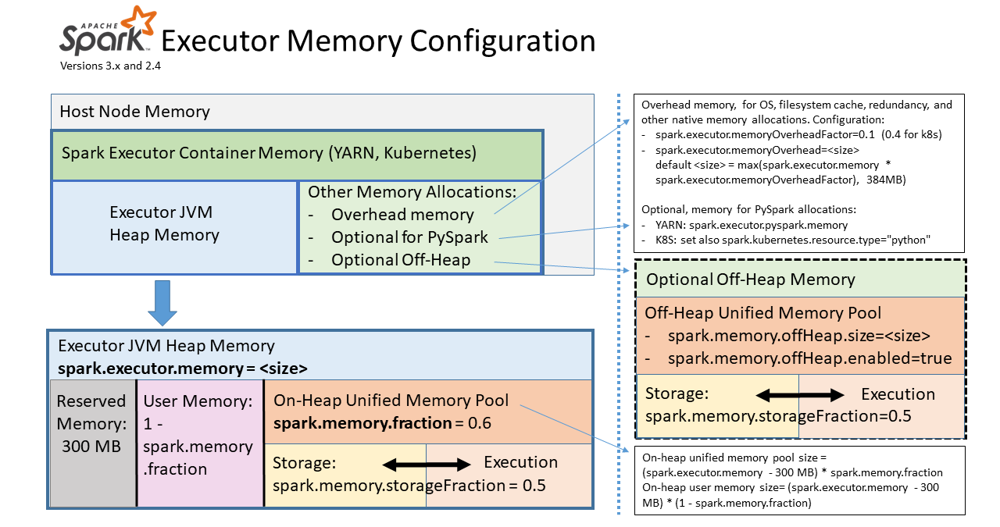

# Reserved Memory
This is the memory reserved by the system, and its size is hardcoded.It's value is 300MB, which means that this 300MB of RAM  
does not participate in Spark memory region size calculations, and its size cannot be changed in any way without Spark recompilation  
or setting `spark.testing.reservedMemory`, which is not recommended as it is a testing parameter not intended to be used in production.  
Be aware, this memory is only called “reserved”, in fact it is not used by Spark in any way, but it sets the limit on what you can allocate  
for Spark usage.Even if you want to give all the Java Heap for Spark to cache your data, you won’t be able to do so as this “reserved”  
part would remain spare (not really spare, it would store lots of Spark internal objects).    
If you don’t give Spark executor at least 1.5 * Reserved Memory = 450MB heap, it will fail with “please use larger heap size” error message.  

# User Memory
For storing the data-structures created and managed by the user’s code  
This is the memory pool that remains after the allocation of Spark Memory, and it is completely up to you to use it in a way you like.  
You can store your own data structures there that would be used in RDD transformations.The size of this memory pool can be calculated as 
`(“Java Heap” – “Reserved Memory”) * (1.0 – spark.memory.fraction)`  
This is the User Memory and its completely up to you what would be stored in this RAM and  
Spark makes completely no accounting on what you do there and whether you respect this boundary or not. Not respecting this boundary in your code might cause OOM error.

# Executer Memory Overview

# spark.driver.memoryOverhead	
Default Value : driverMemory * spark.driver.memoryOverheadFactor, with minimum of 384  
Amount of non-heap memory to be allocated per driver process in cluster mode, in MiB unless otherwise specified.  
This is memory that accounts for things like VM overheads, interned strings, other native overheads, etc.  
This tends to grow with the container size (typically 6-10% of driver memory). This option is currently supported on YARN, Mesos and Kubernetes.  
Note: Non-heap memory includes off-heap memory (when spark.memory.offHeap.enabled=true) and memory used by other driver processes (e.g. python process that goes with a PySpark driver)  
and memory used by other non-driver processes running in the same container.  
The maximum memory size of container to running driver is determined by the sum of spark.driver.memoryOverhead and spark.driver.memory.

# spark.driver.memoryOverheadFactor	
Default Value : 0.10  
Fraction of driver memory to be allocated as additional non-heap memory per driver process in cluster mode. This is memory that accounts for things like VM overheads, interned strings, other native overheads, etc.  
This tends to grow with the container size. This value defaults to 0.10 except for Kubernetes non-JVM jobs, which defaults to 0.40. This is done as non-JVM tasks need more non-JVM heap space and such tasks commonly fail with "Memory Overhead Exceeded" errors.  
This preempts this error with a higher default. This value is ignored if spark.driver.memoryOverhead is set directly.

# spark.executor.memoryOverhead	
Default Value : executorMemory * spark.executor.memoryOverheadFactor, with minimum of 384    
Amount of additional memory to be allocated per executor process, in MiB unless otherwise specified. This is memory that accounts for things like VM overheads, interned strings, other native overheads, etc. This tends to grow with the executor size (typically 6-10%). This option is currently supported on YARN and Kubernetes.  
Note: Additional memory includes PySpark executor memory (when spark.executor.pyspark.memory is not configured) and memory used by other non-executor processes running in the same container.The maximum memory size of container to running executor is determined by the sum of spark.executor.memoryOverhead, spark.executor.memory, spark.memory.offHeap.size and spark.executor.pyspark.memory.

# spark.executor.memoryOverheadFactor
Default Value : 0.10  
Fraction of executor memory to be allocated as additional non-heap memory per executor process. This is memory that accounts for things like VM overheads, interned strings, other native overheads, etc.  
This tends to grow with the container size. This value defaults to 0.10 except for Kubernetes non-JVM jobs, which defaults to 0.40. This is done as non-JVM tasks need more non-JVM heap space and such tasks commonly fail with "Memory Overhead Exceeded" errors.  
This preempts this error with a higher default. This value is ignored if spark.executor.memoryOverhead is set directly.