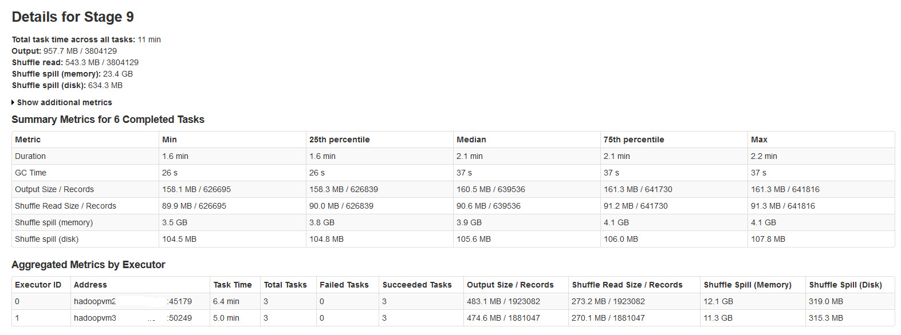

# What is spill & where can we find it in Spark UI if data is spilling ?
A memory spill in Apache Spark is the process of transferring data from RAM to disk, and potentially back again.  
This happens when the dataset exceeds the available memory capacity of an executor during tasks that require more memory than is available

In Apache Spark, you can identify a spill in the Spark Web UI under the Stages tab. The Stages tab displays two values in pairs:  
- __Shuffle spill (memory)__ is the size of the deserialized form of the shuffled data in memory.
- __Shuffle spill (disk)__ is the size of the serialized form of the data on disk.  

Possible Action to Generate Spill
Any action in a Spark job can lead to an increase in data size going over memory capacity.

- Reducing spark.sql.shuffle.partitions leads to bigger file sizes per partition.
- join() or crossJoin() between 2 data tables.
- Setting spark.sql.files.maxPartitionBytes to high (default is 128 MBs).
- Do explode() on multiple column in data tables.
- The result of having skewed data can be a data spill

If no spill is occurring, these columns/rows will not show up. You can also see the amount of memory data spill in the Query Details under the SQL tab, but the disk data spill might not be visible.

