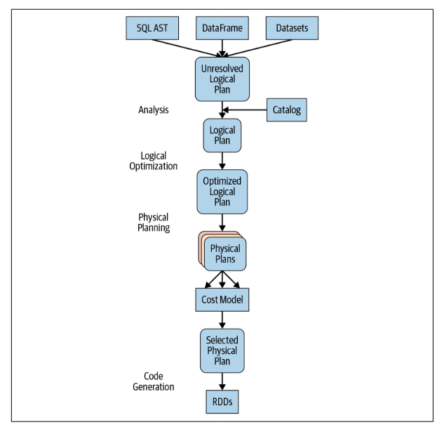

# The Catalyst Optimizer
At the core of the Spark SQL engine are the Catalyst optimizer and Project Tungsten. Together, these support the  
high-level DataFrame and Dataset APIs and SQL queries. The Catalyst optimizer takes a computational query and  
converts it into an execution plan. It goes through four transformational phases, as below
1. Analysis
2. Logical optimization
3. Physical planning
4. Code generation

## Phase 1: Analysis
The Spark SQL engine begins by generating an abstract syntax tree (AST) for the SQL or DataFrame query. In this initial  
phase, any columns or table names will be resolved by consulting an internal Catalog, a programmatic interface to  
Spark SQL that holds a list of names of columns, data types, functions, tables, databases, etc. Once they’ve all been  
successfully resolved, the query proceeds to the next phase.

## Phase 2: Logical optimization
This phase comprises two internal stages. Applying a standard rule-based optimization approach,    
the Catalyst optimizer will first construct a set of multiple plans and then, using its cost-based optimizer (CBO),   
assign costs to each plan. These plans are laid out as operator trees they may include, for example, the process of    
constant folding, predicate pushdown, projection pruning, Boolean expression simplification, etc. This logical    
plan is the input into the physical plan.

## Phase 3: Physical planning
In this phase, Spark SQL generates an optimal physical plan for the selected logical plan, using physical operators  
that match those available in the Spark execution engine.

## Phase 4: Code generation
The final phase of query optimization involves generating efficient Java bytecode to run on each machine. Because    
Spark SQL can operate on data sets loaded in memory, Spark can use state-of-the-art compiler technology for code    
generation to speed up execution. In other words, it acts as a compiler. Project Tungsten, which facilitates whole-stage    
code generation, plays a role here. Just what is whole-stage code generation? It’s a physical query optimization phase that  
collapses the whole query into a single function, getting rid of virtual function calls and employing CPU registers for    
intermediate data. The second-generation Tungsten engine, introduced in Spark 2.0, uses this approach to generate    
compact RDD code for final execution. This streamlined strategy significantly improves CPU efficiency and performance.  