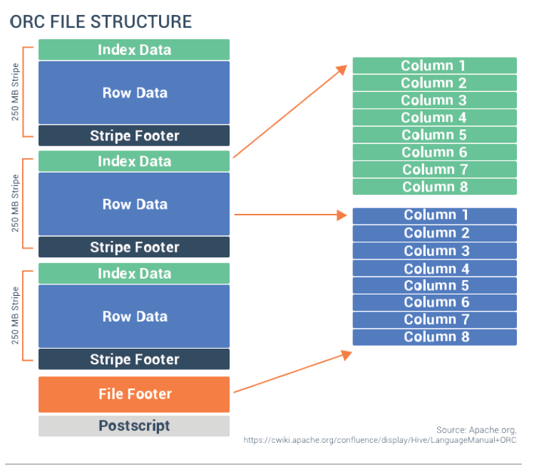

ORC file format can be majorly classified into three parts, namely 

## Header 
Header will store the 4-byte number containing 'ORC', which tells the system that it is a file format of type ORC   

## Stripes
DataBlock as shown in the above diagram comprises the actual data elements and their indexes. Data  
 is stored as the ORC file in the form group of stripes. Each Stripe holds the rows of data, and the size of the stripe  
by default is of 250 MB.

Stripes are further subdivided into three more categories, namely  
- __Indexing:__ Index data consists of min and max values for each column as well as the row positions within each column.     
ORC indexes help to locate the stripes based on the data required as well as row groups  
- __Data__  
- __Stripe Footer:__ Stripe footer contains the encoding of each column and the directory of the streams as well as their location.    

## Footer 
The footer section consists of three parts
- __File metadata:__ The file Metadata section contains the various statistical information related to the columns and  
  this information is present at a stripe level. These statistics enable input split elimination based on predicate  
  push down which are evaluated for each stripe
- __File footer:__ The file footer contains information regarding the list of stripes in the file, number of rows per  
  stripe, and the data type for each column. It also contains aggregates counts at column-level like min, max, and sum
- __Postscript:__ Postscript section contains the file information like the length of the file’s Footer and Metadata  
  sections, the version of the file, and the compression parameters like general compression used (eg. none, zlib, or  
  snappy) and the size of the compressed folder.

